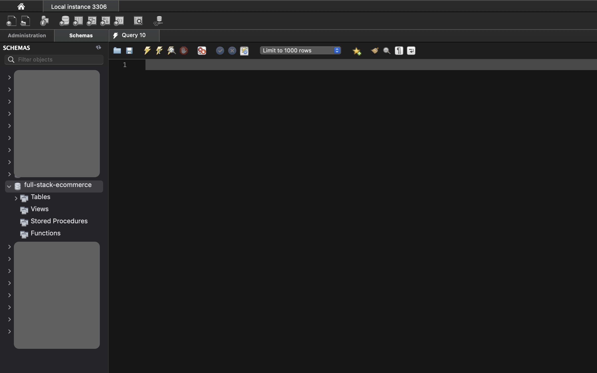
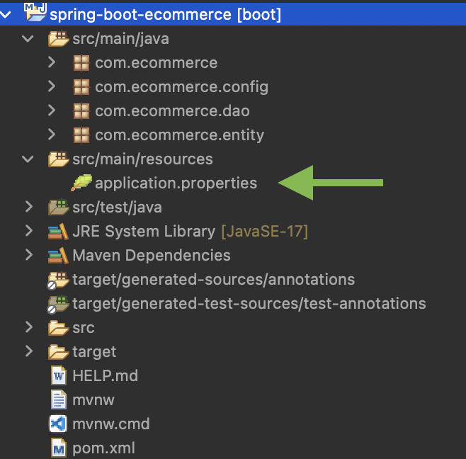
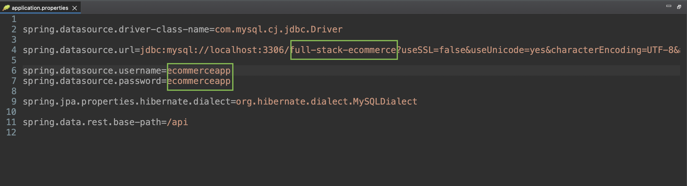
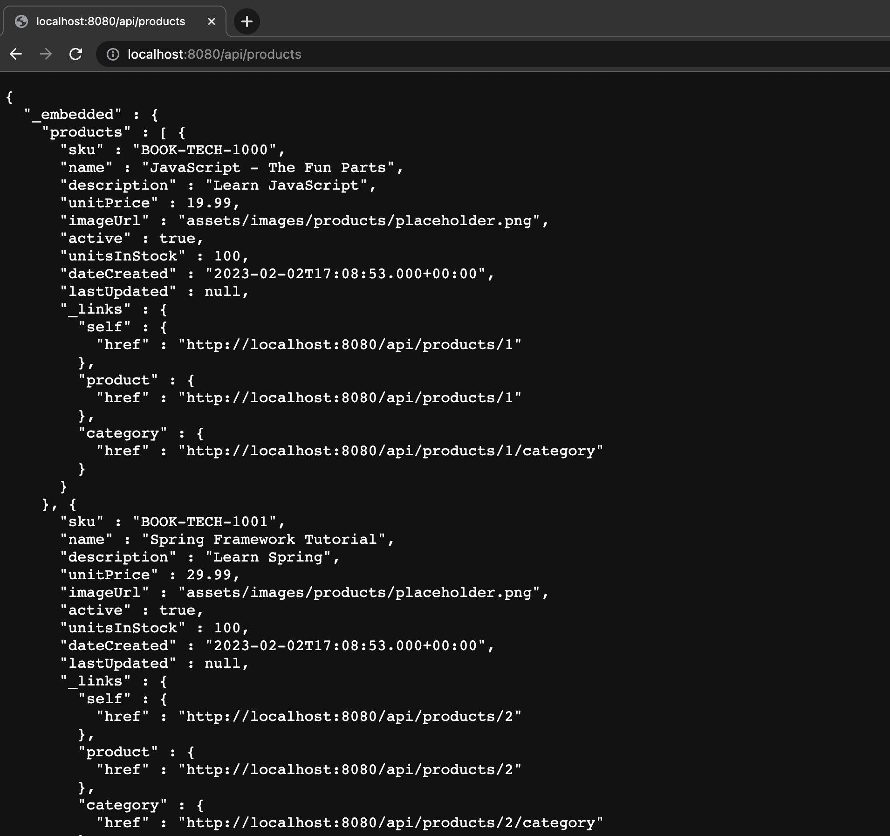

# Spring Boot E-commerce App with MySQL

This project was generated with [spring initializr](https://start.spring.io).

The application is built with Java version 17.0.1 and MySQL version 8.0.30.

## Prerequisites

Before you start using the application, make sure you have the following installed on your machine:

    - Java 17.0.1 
    - MySQL 8.0.30
    - Maven
    - Any IDE of your choice (e.g. IntelliJ IDEA, Eclipse)

## Installation

  Clone the repository

  Open the project in your preferred IDE. (Eclipse for this project)

  Create a database in MySQL. (In this application its full-stack-ecommerce)

   

  

 
  Update the application properties file with your MySQL credentials.

  > application.properties file is inside src/main/resources/ directory.
   

  

   

 Change username,password and schema that match your with your database.

 

  

## Development Server

Run the application as a Spring Boot application. Navigate to <http://localhost:8080/api/products/> on your browser.  

  

# Backend is up and running

Now its time to run angular app. [Click here](https://github.com/kafleprakash96/fullstack-ecommerce-angular) for frontend of this application.

## Contributing

If you would like to contribute to the project, please submit a pull request.

## Support

If you need any help, please open an issue in the repository.
